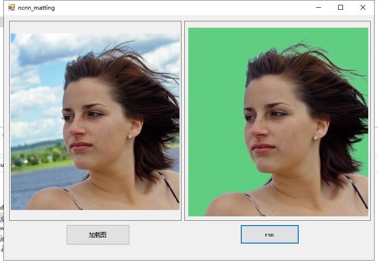
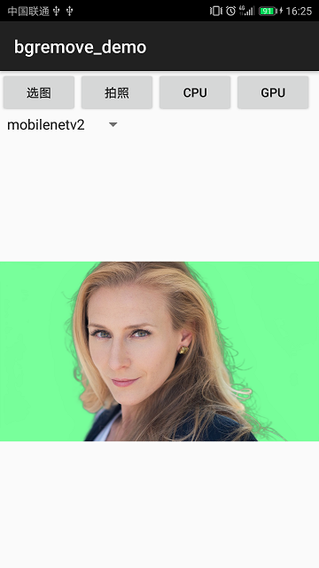

# ncnn_Android_matting
Android and Windows human matting demo infer by ncnn  

## support model  
##### 1.MODNet(mobilenetv2)  
##### 2.MODNet(hrnet-w18)  
##### 3.P3M(the model is large so windows demo only)  
##### 4.PP-Matting-512  
## how to build and run
### step1
https://github.com/Tencent/ncnn/releases

* Download ncnn-YYYYMMDD-android-vulkan.zip or build ncnn for android yourself
* Extract ncnn-YYYYMMDD-android-vulkan.zip into **app/src/main/jni** and change the **ncnn_DIR** path to yours in **app/src/main/jni/CMakeLists.txt**

### step2
https://github.com/nihui/opencv-mobile

* Download opencv-mobile-XYZ-android.zip
* Extract opencv-mobile-XYZ-android.zip into **app/src/main/jni** and change the **OpenCV_DIR** path to yours in **app/src/main/jni/CMakeLists.txt**

### step3
* Open this project with Android Studio, build it and enjoy!  

## result  
  
  

## reference  
1.https://github.com/nihui/ncnn-android-styletransfer  
2.https://github.com/ZHKKKe/MODNet  
3.https://github.com/PaddlePaddle/PaddleSeg/tree/release/2.5/Matting  
4.https://github.com/JizhiziLi/P3M  
